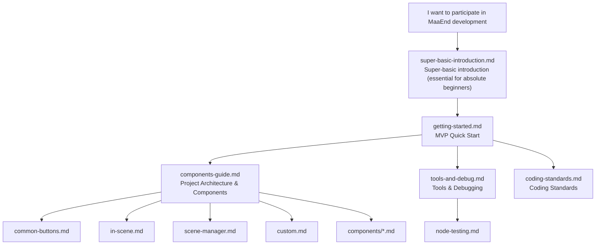

# MaaEnd Developer Documentation

This directory contains all developer documentation for the MaaEnd project.

## Reading Path

It is recommended to read in the following order:

1.  Absolute beginner, confused by `git clone`, `pnpm install` → `super-basic-introduction.md`
2.  Setting up the environment, running the program, making a change → `getting-started.md`
3.  Understanding the project architecture and reusable nodes → `components-guide.md`
4.  Mastering development tools and debugging workflows → `tools-and-debug.md`
5.  Consulting the coding standards → `coding-standards.md`
6.  When writing test sets → `node-testing.md`
7.  When using an advanced component → Check the corresponding documentation under `components/`
8.  When maintaining a specific task → Check the corresponding documentation under `tasks/`

> [!WARNING]
> **You must read the [coding standards](./coding-standards.md) before submitting any code.**
> PRs that do not comply with the standards will be directly rejected.

## Documentation Index

### Tier 1 — Quick Start

| Document                                                              | Description                                                                                                 |
| --------------------------------------------------------------------- | ----------------------------------------------------------------------------------------------------------- |
| [Super-basic Introduction](./super-basic-introduction.md) | For absolute beginners: What are Git, terminal, VS Code, JSON, and how to use them                          |
| [Getting Started](./getting-started.md)                                | Set up the environment, run the program, complete your first change and PR within 10 minutes                |

### Tier 2 — Reference Manual

| Document                                                                    | Description                                                                                                 |
| --------------------------------------------------------------------------- | ----------------------------------------------------------------------------------------------------------- |
| [DeepWiki — MaaEnd](https://deepwiki.com/MaaEnd/MaaEnd)                           | AI-powered online project documentation overview                                                            |
| [Components Guide](./components-guide.md)                                | Project architecture, determining where to make changes, reusable node directory                            |
| [Tools & Debugging](./tools-and-debug.md)                               | Development tools list, common debugging entry points, community group information                          |
| [Node Testing](./node-testing.md)                                    | How to write and run node tests to verify stable recognition hits                                           |
| [Pipeline Protocol](https://maafw.com/docs/3.1-PipelineProtocol/)                               | Full text of the official MaaFramework Pipeline Protocol                                                    |

### Tier 3 — Standards & Constraints

| Document                                                                 | Description                                                                                                 |
| ------------------------------------------------------------------------ | ----------------------------------------------------------------------------------------------------------- |
| [**Coding Standards (Must Read)**](./coding-standards.md)                | Pipeline / Go / Cpp coding rules, pre-commit checks, common pitfalls                                       |

### Pipeline Basic Components

The most commonly used reusable nodes in daily development. It is recommended for all Pipeline developers to consult them for reuse during development.

| Document                                                                      | Description                                                                                                |
| ----------------------------------------------------------------------------- | ---------------------------------------------------------------------------------------------------------- |
| [Common Buttons](./common-buttons.md)                                        | Generic button nodes like white/yellow confirm, cancel, close, teleport, etc.                              |
| [InScene Scene Recognition](./in-scene.md)                             | Universal scene recognition to determine the current screen/scene                                          |
| [SceneManager Scene Navigation](./scene-manager.md)                         | Universal navigation mechanism to automatically navigate/teleport to target scene/UI from any interface     |
| [Custom Actions & Recognition](./custom.md)                          | Public Custom nodes like SubTask, ClearHitCount, ExpressionRecognition, etc.                               |

### Advanced Component Reference (`components/`)

Consult as needed. Only required when using the corresponding component.

| Document                                                                           | Description                                                                                          |
| ---------------------------------------------------------------------------------- | ---------------------------------------------------------------------------------------------------- |
| [AutoFight Automatic Combat](./components/auto-fight.md)                                 | In-battle automation module for automatically performing normal attacks, skills, chain skills, etc.   |
| [CharacterController Character Control](./components/character-controller.md)                       | Character view rotation, movement, and automatic movement towards a target                            |
| [BetterSliding Quantitative Sliding](./components/better-sliding.md)                          | Public custom action for adjusting discrete sliders by target value                                   |
| [MapLocator Minimap Localization](./components/map-locator.md)                              | AI + CV-based minimap localization system outputting area, coordinates, and orientation               |
| [MapTracker Minimap Tracking](./components/map-tracker.md)                                 | Computer vision-based minimap tracking and path movement                                              |
| [MapNavigator Path Navigation](./components/map-navigator.md)                                | High-precision automatic navigation Action, with a GUI recording tool                                 |

### Task Maintenance Documentation (`tasks/`)

Only required when maintaining the corresponding task.

| Document                                                                             | Description                                                                                          |
| ------------------------------------------------------------------------------------ | ---------------------------------------------------------------------------------------------------- |
| [AutoStockpile](./tasks/auto-stockpile-maintain.md)                                                | Maintenance for goods templates, goods mapping, price thresholds, and regional expansion             |
| [DijiangRewards Infrastructure Tasks](./tasks/dijiang-rewards-maintain.md)                          | Main flow, stage responsibilities, and interface option override logic                                |
| [CreditShopping Credit Store](./tasks/credit-shopping-maintain.md)                                  | Purchase priority, credit linkage refresh strategy, and goods expansion                              |
| [EnvironmentMonitoring](./tasks/environment-monitoring-maintain.md)                                        | Observation point route data, `pipeline-generate` automatic generation, and new point integration    |

### Third-Party Protocol Documentation (`protocol/`)

Defines the format specifications for files written by MaaEnd, for reliable reading by external tools (data analysis panels, web frontends, etc.).

| Document                                                                                      | Description                                                                                          |
| --------------------------------------------------------------------------------------------- | ---------------------------------------------------------------------------------------------------- |
| [AutoStockpile Daily Price Record](../protocol/autostockpile-daily-storage/protocol.md)                                      | `ElasticGoodsPrices.json` file format, path resolution, and writing rules                           |

## Quick Navigation

| I want to...                          | Where to look                                                                                                                                                                                      |
| ------------------------------------- | --------------------------------------------------------------------------------------------------------------------------------------------------------------------------------------------------- |
| Absolute beginner, don't understand terms | [super-basic-introduction.md](./super-basic-introduction.md)                                                                                                                                                  |
| First participation, starting from scratch | [getting-started.md](./getting-started.md)                                                                                                                                                          |
| Understand the project architecture | [components-guide.md](./components-guide.md)                                                                                                                                                         |
| Modify a Pipeline node               | [components-guide.md](./components-guide.md) → [common-buttons.md](./common-buttons.md) / [in-scene.md](./in-scene.md) / [scene-manager.md](./scene-manager.md)                             |
| Write or debug a Go Service          | [components-guide.md](./components-guide.md) → [custom.md](./custom.md)                                                                                                                     |
| Consult coding standards             | [coding-standards.md](./coding-standards.md)                                                                                                                                                         |

## Communication

Development QQ Group: [1072587329](https://qm.qq.com/q/EyirQpBiW4) (Working group, welcome to join for development, but does not handle user issues)

## AI Automatic Sync

- The corresponding GitHub Action is located at: `.github/workflows/docs-sync.yml`
- Purpose: After manual trigger, it first fixes a repository snapshot. Then, based on the Chinese source file hashes recorded in `docs/en_us/.docs-sync-state.json`, it identifies the `docs/zh_cn/**` documents in that snapshot that need synchronization, translates the corresponding content to `docs/en_us/**`, and finally a bot automatically creates a PR.
- Current mode: Manual `workflow_dispatch` only; automatic triggering has been commented out and disabled for now.
- Limitation: The LLM is only used as a per-file translator; diff collection, documentation link rewriting, file writing, allowed modification scope validation, branch pushing, and PR creation are all handled by scripts and workflows.
- Translation script: `tools/docs/translate_with_llm.py`
- Runtime dependencies: A `DOCS_TRANSLATION_CONFIG` secret; `MAAEND_BOT_TOKEN` is optional and uses GitHub Actions' built-in `GITHUB_TOKEN` if not configured.
- `DOCS_TRANSLATION_CONFIG` contains translation endpoint configuration: `api_key`, `model`, `base_url`, optional `api_style` (`openai`, `anthropic`, or `gemini`), and `max_tokens`.
- Optional backend: You can select `translator=copilot` during manual trigger, which uses `COPILOT_GITHUB_TOKEN`; the default is `translator=config`, which does not use Copilot normally.
- `pr_branch` can only use the `chore/docs-auto-sync*` prefix and cannot be equal to the default branch name.
